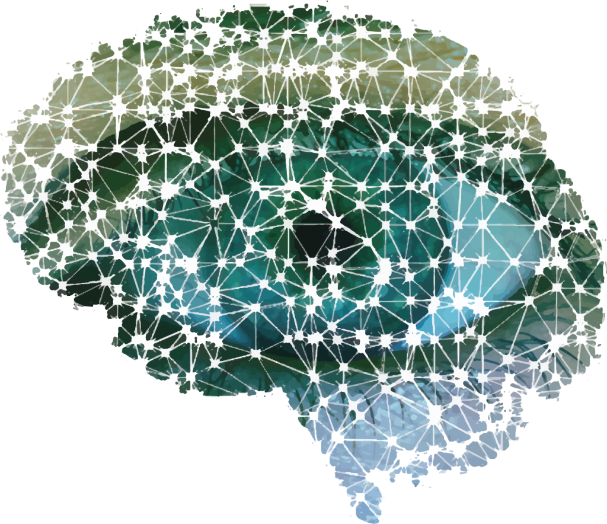

# Projet_3A_motion_recognition
Apprentissage automatique pour la reconnaissance d’émotion/de style à partir de séquences de mouvement humain

Ce projet vise à classifier des actions humaines tels que (danser, saluer, lever le bras gauche/droit, ...) en s'appuyant sur des modèles de machine learning.

Les données utilisées sont de sources diverses et représentent des succéssions de positions de chaque joint du squelette d'un sujet. Chaque joint est repésenter par des coordonnées cartésiennes (x, y, z) en 3D.

On s'est appuyé sur un premier algorithme plus ou moins naïf du type KNN(K plus proches voisins) pour ensuite nous diriger vers des algorithmes de deepl learning tels que les modèles LSTM et CNN.
 

